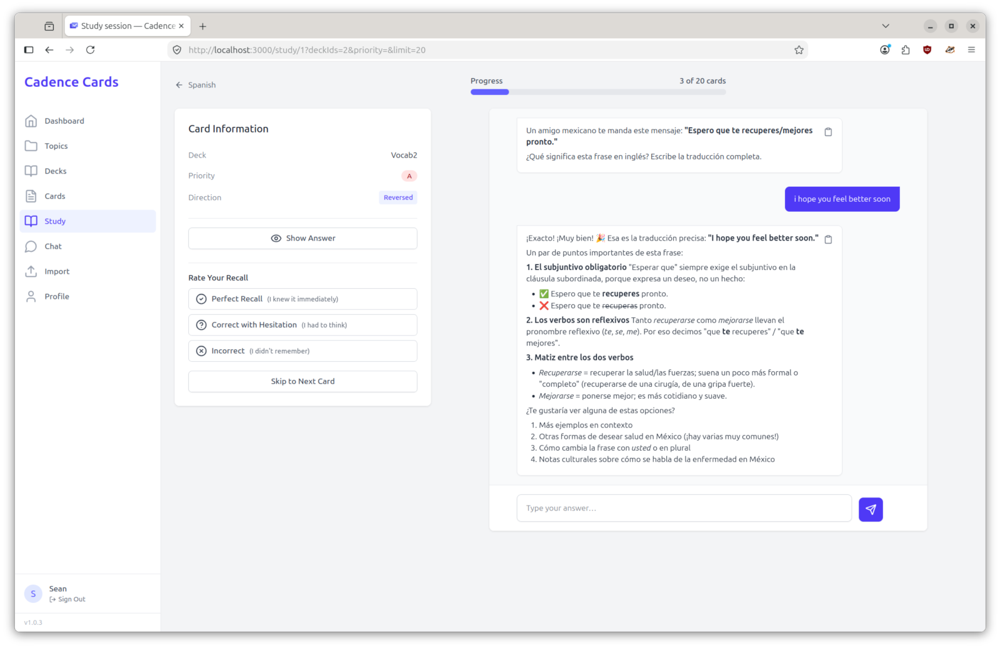
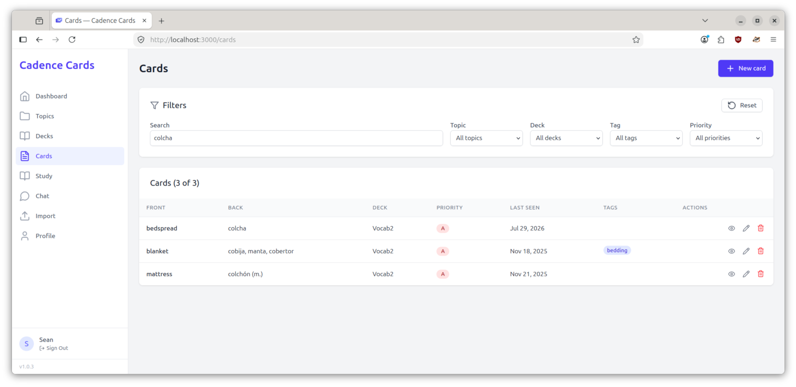
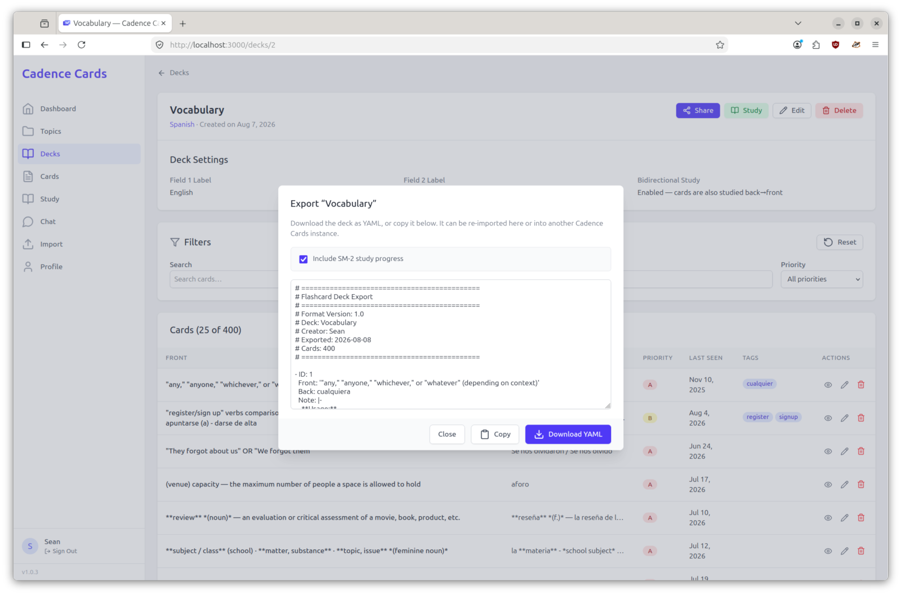

# Cadence Cards

A self-hosted flashcard app with SM-2 spaced repetition, where **Claude quizzes you** instead of
just showing you the answer. Each card becomes a question generated from its content; you type your
answer, Claude tells you what you got right and where you were fuzzy, and then you grade yourself.
The whole thing is a single Go binary and one SQLite file — one container to run, one file to back
up, no NPM, no build step.



## Features

### Organize your material

- **Topics → decks → cards.** Topics group decks; decks group cards. Deleting cascades downward.
- **Custom field labels per deck** — "Front"/"Back" by default, but a language deck might use
  "English"/"Spanish".
- **Bidirectional decks** study both front→back and back→front, with *independent* SM-2 state for
  each direction. Knowing "hola → hello" doesn't mean you know "hello → hola", and the app tracks
  them separately.
- **Priority A / B / C** per card, so high-priority material comes up first in a session.
- **Tags** (free-form, chip-style entry) and a **note** field per card for context that isn't part
  of the question or answer.

### Study with Claude

- Claude reads the card server-side and asks you a question about it — not the literal card front,
  but a question that tests whether you actually understand it.
- Answer in the chat and get a reply that corrects and expands. Enter sends, Shift+Enter adds a
  newline. Replies render as Markdown and each has a copy button.
- **Show/Hide answer** whenever you want to check yourself.
- Grade with three buttons: **Perfect Recall** (I knew it immediately), **Correct with Hesitation**
  (I had to think), **Incorrect** (I didn't remember). The app tells you when the card comes back.
- **Changed your mind? Regrade.** Clicking a different grade rewinds the schedule to its
  pre-review state and reapplies, so second-guessing yourself never compounds the interval.
- **Skip** a card without grading it, with a confirmation so you don't do it by accident.
- A progress bar tracks the session, and **the whole session lives in the URL** — refresh, hit
  back, or bookmark mid-session and nothing is lost.

### Set up a session the way you want

Before starting, you see how many cards are due in each priority band, then choose:

- **Which decks** — any subset, with All / None shortcuts and card counts.
- **Priority** — all, or only A, B, or C.
- **New cards** — include or exclude cards you've never studied.
- **Card limit** — no limit, or 10 / 20 / 30 / 50 / 100 (default 20).

Within the session, cards are drawn from the highest-priority band that still has due cards, chosen
at random within that band.

### Spaced repetition (SM-2)

The classic SuperMemo-2 algorithm: grades map to quality 5 / 4 / 0; easiness updates by
`EF + (0.1 − (5−q)(0.08 + (5−q)·0.02))` with a floor of 1.3 and no ceiling; intervals go 1 day →
6 days → `round(interval × easiness)`; an incorrect answer resets the interval to 1 day and the
repetition count to 0.

Due dates use **local-midnight day boundaries**, so a card due "tomorrow" is available at midnight
in your timezone — which is why `TZ` matters (see [Configuration](#configuration)).

Every card's page shows its SM-2 parameters (repetitions, easiness, interval, last grade) for each
direction, each with its own **Reset Progress** button.

### Chat about a topic

Separate from studying, each topic has a free-form chat page — useful for "explain this differently"
or "how does X relate to Y" without being tied to a specific card.

### Tune Claude per topic

Each topic carries its own prompt configuration, all optional and all with sensible fallbacks:

| Field | What it changes | Fallback |
| --- | --- | --- |
| Topic Description | "specializing in …" | the topic name |
| Expertise | the role Claude takes ("a knowledgeable {topic} {expertise}") | `tutor` |
| Focus | what Claude emphasizes when questioning you | `concepts and principles` |
| Context Type | the kind of extra context Claude volunteers | `additional context` |
| Example | a worked exchange injected into the prompt to set the house style | a generic built-in |
| Question Prompt | extra instructions appended to every question-generation request | *(none)* |

A topic for medical terminology and one for Spanish vocabulary should be quizzed very differently;
this is where you say how.

### Find cards fast

The card list (and each deck's card table) is fully server-rendered and URL-addressable, so any
view you're looking at is a link you can share or bookmark:

- **Search** across front, back, and note (debounced as you type).
- **Filter** by topic, deck, tag, or priority — with a Reset button.
- **Sort** by front, deck, priority, or last-seen date.
- **25 per page**, with full pagination.



### Import and export

- **Export** any deck as YAML, with or without SM-2 study progress. Copy it from a dialog or
  download it as `<deck_name>_cards.yaml`.
- **Import** by pasting YAML into a target deck (1 MB limit). The metadata header is optional.
- **Validation reports each bad card individually** ("Card at index 4: …") and imports the rest
  rather than aborting the whole file.
- If the YAML carries reverse-direction SM-2 parameters and the target deck is one-directional, the
  deck is switched to bidirectional so that progress is actually used.



The format is a plain YAML list, optionally preceded by a `#` comment header:

```yaml
# ============================================
# Flashcard Deck Export
# ============================================
# Format Version: 1.0
# Deck: Vocabulary
# Creator: Sean
# Exported: 2026-08-01
# Cards: 1
# ============================================

- ID: 1
  Front: hola
  Back: hello
  Note: null
  Priority: A
  Tags:
    - greeting
  LastSeen: 2026-07-20
  Grade: CORRECT_PERFECT_RECALL
  RepCount: 2
  Easiness: 2.6
  Interval: 6
  ReverseLastSeen: null
  ReverseGrade: null
  ReverseRepCount: 0
  ReverseEasiness: 2.5
  ReverseInterval: 1
```

`Front` and `Back` are required; everything else has a default (`Priority: B`, `RepCount: 0`,
`Easiness: 2.5`, `Interval: 1`, `Tags: []`). Dates are date-only. The `LastSeen`/`Grade`/`RepCount`/
`Easiness`/`Interval` block and its `Reverse*` twin are omitted entirely when you export without
study progress. Grades are `CORRECT_PERFECT_RECALL`, `CORRECT_WITH_HESITATION`, or `INCORRECT`.

### Dashboard

Totals for topics, decks, and cards; your overall correct rate; cards due today split by priority;
and your five most recent reviews.

### Accounts and security

- Email + password accounts, bcrypt-hashed (cost 12). Public registration is **off by default** —
  a single-user or invite-only instance is the expected shape.
- Sessions are **server-side and revocable** (30 days), stored only as a SHA-256 hash. Changing your
  password signs out every other session.
- Progressive lockouts on failed logins (per IP and per account) and a general per-IP request limit.
- Strict Content-Security-Policy: no inline scripts or styles, no `unsafe-eval`. Claude's replies
  are rendered as Markdown with raw HTML escaped.

## Try it locally

You need **Go** (the toolchain version is pinned in `go.mod`) and nothing else. No C compiler — the
SQLite driver is pure Go. No Node, no NPM, no frontend build.

```bash
git clone <this repo> && cd cadence-cards-htmx
DB_PATH=./dev.db COOKIE_SECURE=false ENABLE_PUBLIC_REGISTRATION=true \
  go run ./cmd/cadence
# → http://localhost:3000
```

Then open http://localhost:3000/register and create an account.

Two things worth knowing on a first run:

- **`COOKIE_SECURE=false` is not optional over plain HTTP.** The app marks its session cookie
  `Secure` by default, and browsers silently drop `Secure` cookies on `http://`. Without this you
  will log in successfully and immediately land back on the login page.
- **`CLAUDE_API_KEY` is optional.** Everything works without it except question generation and
  chat, which show error bubbles. The startup log line includes `claudeConfigured` so you can tell
  at a glance whether your key actually reached the process.

The database is created on first run, including its schema — there is no separate migration step.

If you prefer not to enable public registration, create the account from the CLI instead (it
prompts for a name and password):

```bash
go run ./cmd/cadence -create-user you@example.com
```

## Configuration

All configuration is environment variables, and none of them are strictly required. `.env.example`
is the template: copy it to `.env`, which both `docker compose` and the binary itself read — compose
for `${VAR}` substitution, the app via `config.Load` at startup.

Precedence is one rule: **a variable already present in the environment is never overwritten by
`.env`.** So compose-supplied values always win in the container, and an inline
`VAR=x go run ./cmd/cadence` always wins locally. `.env` is listed in `.dockerignore`, so the image
never contains one and the file is effectively a local-development convenience. A missing `.env` is
not an error; a malformed line fails startup with the file and line number.

| Variable | Default | Read by | Notes |
| --- | --- | --- | --- |
| `PORT` | `3000` | app | Compose hardcodes `3000`; effectively local-dev only. |
| `DB_PATH` | `/data/cadence.db` | app | Compose hardcodes the volume path. Set `./dev.db` locally. |
| `CLAUDE_API_KEY` | *(empty)* | app | Study-question generation and chat. Unset ⇒ those features return error bubbles; the rest of the app works. |
| `CLAUDE_MODEL` | `claude-opus-5` | app | |
| `CLAUDE_MAX_TOKENS` | `16000` | app | Caps thinking **and** reply together, so leave headroom — a tight value truncates the answer. Must be ≥ 1. |
| `ENABLE_PUBLIC_REGISTRATION` | `false` | app | When off, create users with `-create-user`. |
| `COOKIE_SECURE` | `true` | app | Set `false` only when serving plain HTTP. **Not forwarded by compose** — local dev only. |
| `DISABLE_RATE_LIMITING` | `false` | app | Dev only. **Not forwarded by compose.** |
| `APP_VERSION` | *(empty)* | app | Informational; shown in the sidebar footer. |
| `TZ` | `UTC` | container, app | SM-2 due dates use local-midnight day boundaries, so this decides when a card becomes due. Set it to your users' timezone. Also honoured from `.env` locally: `config.Load` runs before anything resolves `time.Local`, so a `TZ` set there still applies. |
| `SHARED_NETWORK_NAME` | `cadence-cards-shared` | compose | External network the reverse proxy lives on. Not seen by the app. |

Booleans are parsed strictly: only the literal string `true` enables them, anything else is false.
`PORT` and `CLAUDE_MAX_TOKENS` fail startup with an error if they are set but unparseable.

The four "rarely needed" variables in `.env.example` (`PORT`, `DB_PATH`, `COOKIE_SECURE`,
`DISABLE_RATE_LIMITING`) are not passed through by [`docker-compose.yml`](docker-compose.yml) —
uncommenting them in `.env` affects a local `go run` but has no effect on the container. Add them to
the `environment:` block if you need them there.

`.env` parsing is deliberately minimal: `KEY=VALUE`, blank lines and `#` comment lines skipped, an
optional `export ` prefix stripped, and the split on the first `=` only. Values may be wrapped in
single or double quotes (escapes are interpreted inside double quotes). There is **no inline-comment
stripping** — an unquoted value runs to end of line, so `NUM=4000 # note` yields the literal
`4000 # note` and a startup error rather than silently truncating. Quote any value containing `#`.

## Deployment

The intended deployment is **one container behind a reverse proxy** that terminates TLS.

```bash
cp .env.example .env                          # fill in CLAUDE_API_KEY, TZ
docker network create cadence-cards-shared    # once, if it doesn't exist
docker compose up -d --build
```

The container joins the external network `${SHARED_NETWORK_NAME}` (default `cadence-cards-shared`)
under the alias `cadence-cards`, and **deliberately publishes no host port**. It is reachable only
from that network, at `cadence-cards:3000` — put your proxy on the same network and point it there.

### What the reverse proxy must do

- **Terminate TLS.** The app sets `Secure` session cookies by default, so it has to be served over
  HTTPS or logins won't stick. (Serving it over plain HTTP means setting `COOKIE_SECURE=false`,
  which you should not do on a public host.)
- **Pass through the browser's `Host` header.** CSRF protection compares `Origin` against `Host` on
  every non-GET request; a rewritten `Host` makes every form submission fail with
  `403 Cross-origin request rejected`.
- **Set `X-Real-IP`.** It is the only client-IP header the app trusts — everything else is
  spoofable. Without it, rate limiting and login lockouts see every request as coming from the
  proxy and will lock out all users at once.
- Optionally point health checks at `GET /api/health`, which pings the database and returns
  `{"status":"ok"}` or a 503. The container already has its own `HEALTHCHECK` on that endpoint.

### First user

With public registration off (the default), create the account from the container:

```bash
docker compose run --rm app -create-user you@example.com
```

### Data and backups

The SQLite database lives at `/data/cadence.db` in the `cadence_data` volume. There is nothing else
to back up — no uploads, no external state.

```bash
docker compose cp app:/data/cadence.db backup-$(date +%F).db
```

**Caveat:** the database runs in WAL mode, so copying `cadence.db` alone from a *running* container
can miss recent commits still sitting in the write-ahead log. For a guaranteed-consistent copy,
either stop the container first, or copy all three of `cadence.db`, `cadence.db-wal`, and
`cadence.db-shm` together. (The runtime image doesn't ship the `sqlite3` CLI, so `.backup` /
`VACUUM INTO` have to be run from the host.)

Expired sessions and stale rate-limiter entries are cleaned up automatically every hour; no cron
job or maintenance task is needed.

## How it's built

- **Go** backend on the standard library's `net/http` (Go 1.22+ route patterns) — no web framework.
- **HTMX** frontend: vendored `htmx.min.js`, ~260 lines of hand-written vanilla JS, hand-written
  CSS. Pages and fragments are rendered server-side by `html/template`.
- **SQLite** via the pure-Go driver `modernc.org/sqlite` — no CGo, one data file, WAL mode.
- **Zero NPM dependencies and no frontend build step.** `web/templates` and `web/static` are
  embedded in the binary with `go:embed` (which does mean editing them requires a rebuild).
- **One container**, based on `ubuntu:resolute`, running as a non-root user with all capabilities
  dropped.
- **Strict CSP** with no `unsafe-inline` and no `unsafe-eval`, which is why there are no inline
  `<script>` tags, no `style=` attributes, and no `hx-on:*` handlers anywhere — all client behavior
  is declarative htmx attributes or delegated `data-*` listeners.

## Development

```bash
go test ./...        # pure logic, store, and httptest handler tests
go vet ./...
gofmt -l .           # must print nothing
```

The test suite also runs inside the Docker build, so a failing test fails the image build.

Once `DB_PATH` and `COOKIE_SECURE` are uncommented in your `.env`, a bare `go run ./cmd/cadence` is
enough; inline variables remain handy for one-off overrides (`CLAUDE_MAX_TOKENS=99 go run
./cmd/cadence`).

```
cmd/cadence/          entrypoint (+ -create-user CLI)
internal/config/      env configuration
internal/sm2/         SM-2 algorithm (pure, with its tests)
internal/yamlio/      YAML export/import
internal/store/       all SQLite access; migrations in store/migrations/
internal/ratelimit/   in-memory request + login-failure limiting
internal/markdown/    goldmark wrapper (raw HTML escaped)
internal/claude/      anthropic-sdk-go client + prompt building
internal/server/      handlers, middleware, template rendering
web/templates/        html/template layouts, pages, HTMX fragments
web/static/           htmx.min.js (vendored), app.css, app.js, favicon
```

## License

[MIT](LICENSE) © 2026 Sean Alexandre
